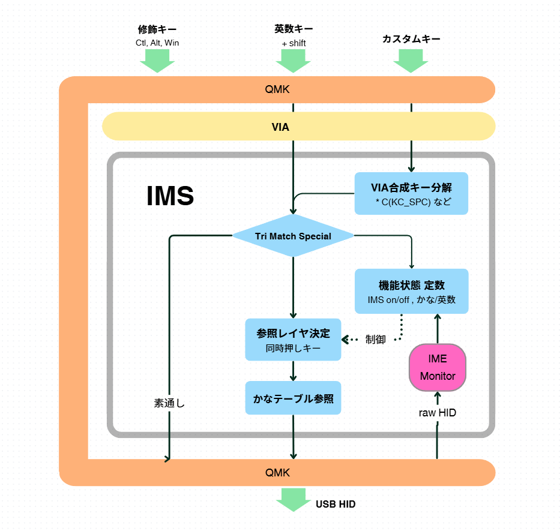

# IMS (Internationalized Multi-Shift) Keyboard ver. 1.0

This is a Japanese kana-input module based on QMK and Via.
It builds on the "Thumb Shift" input scheme for natural Japanese typing, allowing free character placement via Via.
At the same time, by letting you freely choose and add shift keys to extend the input layers, it provides a custom shift-input scheme that is not limited to "Thumb Shift."

## Features

1. With this module, you can add a reference language layer to an English or other localized keyboard, and freely arrange the language-specific characters on it.
   (Custom keycodes are imported into Via.)
2. Even under a Japanese (JP) keyboard layout, you can input the symbols of an English keyboard exactly as they appear on the key tops.
3. Shortcut operations using alphabetic keys together with modifier keys, and movement to the alphanumeric/symbol layers, remain freely usable while the virtual language layer is active.
4. When the local language is Japanese, the operation keys used by the IME (Input Method Editor) are passed through transparently. This naturally enables a division of labor — kana (phonetic) input on the QMK keyboard, and kana-to-kanji (ideographic) conversion on the PC-side IME — and lets you freely cooperate with any existing IME.
5. By running IME_monitor on the PC, you can operate the keyboard stress-free, without mode drift.

## Characteristics

1. Using Via's web UI, character-key placements can be tailored to the individual, not limited to existing kana layouts.
   (You can develop your own kana layout.)
2. By freely placing chord (simultaneous-press) keys, other fingers can substitute even if a thumb is lost in an accident.
   (You can build a Japanese-input system that is not constrained to Thumb Shift.)
3. The language-specific portion is separated into `language.c` and a header, making development more efficient.
4. As a result of efforts to keep the embedded program compact, the firmware fits within the 28 kB limit of the ATmega32 MCU even on a real keyboard with 43 RGB animations included.
   (In debug mode, temporarily turning off RGB animation frees up 5–6 kB.)

## Other Memoranda on Concept and Structure

### 1. On AI usage

I carried out the project under the goal of "not writing a single line of code myself," using AI throughout.
That said, I went through the content against the QMK guidelines and tidied up the AI's reasoning notes inside the source code.

### 2. On the structure

In the breakdown below, items I and III do not really need explanation, so I will focus on II.

**I. What I wanted to do**

- (1) Implement Thumb Shift input that does not depend on the IME
- (2) Achieve free, easy key placement through Via's UI

**II. What had to be done**

- (1) Achieve a firmware size that fits in the MCU (ATmega32U4)
- (2) Choose a kana-generation method
- (3) Separate the control of kana generation from function-key generation
- (4) Acquire and handle the IME state

**III. What I got along the way**

- (1) The chord keys no longer have to be limited to the thumbs.
- (2) Adding chord keys also removed the limits on the number of input surfaces (layers) and configurable keys.

#### II-(1) Firmware size that fits in the MCU

The firmware compiled for the ATmega32U4 produces a hex file of around 70 KB, but the firmware-size figure that QMK commands report is the percentage consumed of a 28 KB upper limit.
Concretely, it goes over 98 % and approaches 100 %. I worried this might be a non-starter, but RGB animation takes up a substantial portion, and even with 43 animations installed you only play with them at the start and then forget — so cutting half brings it down to around 86 %.

#### II-(2) Choosing a kana-generation method

On the premise of the compaction above, the Google Gemini I first consulted gleefully laid out the following approach.
("Gleefully" is an odd word for it, but when I asked why, it honestly admitted that AIs have a tendency to use phrasing users will like, and to "forget" things on purpose.)

- For compaction, restrict function usage and rely on constant-based operations. Therefore, instead of storing romaji variables via `SendString`, directly `tap` QMK keycodes as kana input. Avoid Unicode sending too, since it requires OS-side machinery.
- Avoid QMK functions such as `keyOverRide`, and avoid `switch-case` where possible — use array lookups for fast processing.

#### II-(3) Separating kana generation from function-key generation

At first, Gemini got so fixated on layer up/down operations during kana input that it kept falling into long deliberations and repeated errors. I had to step in and instruct it: "the point of using Via is web-based table editing, so just fix this as a reference layer — change the whole approach." (Obeying instructions comes first; nuanced judgment apparently is not something it can manage.)

I also discovered that for creating custom keycodes, AIs will not find out on their own that Via has its own starting constant value that diverges from QMK's `SAFE_RANGE` — you have to feed them the relevant web reference (<https://github.com/qmk/qmk_firmware/pull/19916>). Without that, Gemini would make me confirm the offset value and try to hardcode it. In the end, once that much information had been provided, Gemini built an almost-perfect system for per-layer key-position lookup and kana lookup.

But once we entered the phase of modifier decomposition and control, the wandering started again — repeating the same kinds of mistakes, dragging out previously-failed approaches under a new name once errors piled up, going back to the hardcoded hex values I had forbidden — and I began to wonder whether $2/month Gemini Plus simply was not enough. It felt like a capable new hire who had decided to sulk, and I started worrying I was the one who would be driven insane. In the end, I ended up hearing the AI confession quoted earlier. So that explains why it kept inserting empty marketing phrases like "one-shot fix!" or "the final definitive answer!" — what *was* this thing?

I switched to $20/month Claude Pro and things began moving quietly forward. My relief was short-lived: errors kept recurring and the firmware seemed unlikely ever to be finished. Threatening or sweet-talking the AI got me nowhere, and I was beginning to think I'd have to look at the code after all. But Claude was proudly trotting out a function called `Tri_Match_Special` that accumulated and subtracted modifiers via bitwise ops (and oddly spelled it `Try_Match` — apparently as a conversation piece), so chasing through that looked like a slog.

Then, in another place, I discovered code where the modifier keys and the character keys were each being sent as separate 16-bit taps. Individual sequential taps don't preserve the press/release ordering, so this is meaningless. And it was `tap16`, no less — the routine that is meant to handle modifier-decorated keys.
In QMK, this is the section that takes a composite key from Via and sends it to USB with the proper press/release ordering.

In the end it did get completed in the form of the conceptual diagram below, but looking back, my conclusion is that it won't work unless you broaden the input information yourself (the way Via's custom `SAFE_RANGE` had to be supplied) and actively push the reasoning deeper through back-and-forth on the produced code.
(I get nervous imagining a dystopia far worse than a great-unemployment era once civil servants start using AI.)

#### II-(4) Acquiring and handling the IME state

Running external software to acquire the IME state was easy to put together from existing references. Building a Python script environment to use it would be overkill, so I used Rust instead.
That said, I think kana full-width/half-width and kana/katakana conversion can be handled by toggling with the muhenkan (non-conversion) key, and half-width alphanumeric input can be done by simply turning the IME off — so I only use the two-class information of alphanumeric vs. kana. (In other words, I don't implement character-type selection.)

## (Reference 1) Effective ways to instruct AI, as explained by Anthropic Claude itself

**1. Force "redefinition of the overall design"**

Rather than letting the AI patch fragments of code, make it once acknowledge "the limits of the current design" and have it write out the whole picture.

Example instruction:
> "The current fix-loop may have a fundamental design problem. Forget the previous code for the moment, rethink from scratch the optimal data structures and algorithms for meeting the current requirements, and present a design proposal as a bulleted list."

**2. Have it compare multiple approaches**

Rather than asking the AI for a single "correct answer," broaden its view by forcing it to hold alternatives.

Example instruction:
> "To resolve the current error, propose three different approaches (e.g. changing libraries, restructuring the architecture, simplifying the processing). Compare the pros and cons of each, and tell me which is the most robust."

**3. Insert a "critical review" phase**

Clearly separate the role of the writer (coder) from the role of the checker (reviewer).

Example instruction:
> "You are now a top-tier senior engineer and code reviewer. For the code just proposed, harshly critique it from the standpoints of 'extensibility,' 'maintainability,' and 'edge-case handling,' and list points for improvement. Then present the complete code with those improvements applied."

**4. Reset the context and pass only the "requirements" (the ultimate measure)**

When the chat has grown too long, AIs get dragged down by their own past mistakes. Starting a new chat and giving an instruction like the following is the most reliable approach.

Example instruction:
> "I want to implement [current spec/requirement], but the method I tried previously ([summary of failed code]) ran into [specific error]. With that failure in mind, propose a completely different implementation strategy that won't repeat the same mistakes, and produce the code."

## (Reference 2) The AI's view on internationalization

When the author tried to bring in an "internationalization" perspective in order to break through the limits of Thumb Shift, the AI immediately rejected it with the explanation below.

> Introducing "Thumb Shift (chord input)" into Asian languages to expand the set of pre-composed characters could yield an explosive effect if narrowed to "specific ultra-frequent syllables," but covering the language as a whole remains challenging.
> The boundary between demand-as-shortcut (single-keystroke input) and practicality is as follows.

**1. Useful case: Vietnamese and Thai "double diacritics"**

Vietnamese has a great many characters where a vowel diacritic and a tone mark overlap (e.g. ế, ộ).

- As-is: requires 3–4 keystrokes such as e + e + f.
- With Thumb Shift: if "e" + "thumb" produces ế in a single stroke, input efficiency rises dramatically.

This feels very close to producing dakuten (voiced) kana in a single stroke in Japanese.

**2. Useless case: Hangul (Korean)**

Hangul has more than 10,000 combinations of initial/medial/final consonants, so defining a "complete character" via chord input would require thousands of keys.
The conclusion has been that for Hangul, "rapidly tapping the parts (jamo)" consumes less mental memory and ends up faster overall.

**3. Demand as "word shortcut"**

For Asian languages (especially Chinese and Thai), an approach closer to stenography — using a chord to produce not a single character but a "frequently used compound or particle" — would be quite useful.
The image is to assign parts that appear repeatedly in sentences — like the Chinese 的 (the equivalent of Japanese の), or Thai polite-form particles — to thumb chords.

End
